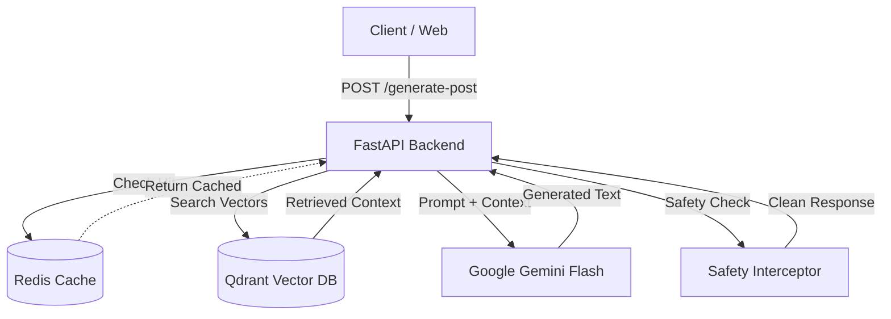

# BrandGuard AI: Intelligenete Social Engine

> An industry-grade RAG pipeline that enforces brand voice, safety protocols, and low-latency generation using Google Gemini, Qdrant, and Redis.


## 📖 Overview

BrandGuard AI is not just a text generator, it is a **compliant content orchestration engine**. It bridges the gap between raw LLM capabilities and strict corporate brand guidelines.

Users send topic requests via the REST API, which are processed by a Dual-Layer Guardrail System. The system retrieves specific brand rules from a Vector Database (Qdrant), generates content using Google Gemini 1.5 Flash, and validates safety protocols before caching the result in Redis for sub-20ms retrieval.

## 🏗️ Architecture

The system implements a local Retrieval-Augmented Generation (RAG) pipeline:


## ⚡ Tech Stack
**Core Application**
- Framework: FastAPI (Async, Pydantic Models)
- Language: Python 3.11
- Documentation: Swagger UI (Auto-generated)
- Containerization: Docker & Docker Compose

**Backend & AI**
- Vector Database: Qdrant 
- Caching: Redis 
- AI Model: Google Gemini Flash
- Embeddings: text-embedding-004 (768 Dimensions)
- Safety: Custom Input/Output Interceptors + `better-profanity`

## 🚀 Features
- **Retrieval Augmented Generation (RAG):** Dynamically injects brand-specific tone and formatting rules based on the platform (LinkedIn vs. Twitter).
- **Dual-Layer Safety:** Blocks toxic inputs instantly and scans final outputs for brand compliance before serving.
- **Smart Caching:** Implements Redis to cache identical requests, reducing API costs and creating sub-20ms response times.
- **Microservices Infrastructure:** Decoupled architecture where the API, Database, and Cache run in isolated, scalable containers.
- **Vector Ingestion:** Specialized pipeline to convert raw text rules into high-dimensional vector embeddings.

## 🛠️ Getting Started
**Prerequisites**
- Python 3.9+
- Docker Desktop
- Google AI Studio API Key

**1. Installation**
```sh
git clone https://github.com/your-username/brand-guard-ai.git
cd brand-guard-ai
# No local pip install needed - Docker handles everything
```

**2. Environment Setup**
Create `.env` file in the root directory:
```ssh
GEMINI_API_KEY=your_google_gemini_key
QDRANT_HOST=qdrant_db
REDIS_HOST=cache
```

**3. Running the application**
```ssh
# Build and start all services (API, Qdrant, Redis)
docker-compose up --build
```
_Test the API at http://localhost:8000/docs_

## 🔮 Roadmap
- [x] Phase 1: Microservices Architecture (Docker/FastAPI)
- [x] Phase 2: Vector Database Integration (Qdrant)
- [x] Phase 3: RAG Pipeline with Gemini
- [x] Phase 4: Safety Guardrails (Input/Output Interceptors)
- [x] Phase 5: Redis Caching Layer
- [ ] Phase 6: PDF Document Ingestion Support

## 🤝 Contributing
1. Fork the Project
2. Create your Feature Branch (git checkout -b feat/AmazingFeature)
3. Commit your Changes (git commit -m 'feat: Add some AmazingFeature')
4. Push to the Branch (git push origin feat/AmazingFeature)
5. Open a Pull Request
